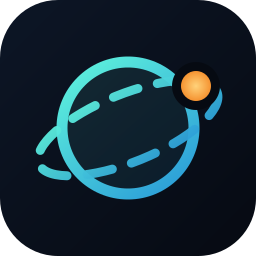

<div align="center">



# Terrafeed

**Open-source global situational awareness on your desktop.**

Twelve live layers — earthquakes, natural hazards, disaster alerts, severe weather, humanitarian
reporting, world news from 31 regional desks, sport, military aviation, vessels, satellites and maritime
chokepoints — drawn on a single offline dark map, with a topic watchlist to decide what reaches you
and alerting that waits for independent sources to agree.

</div>

---

## What it does

| | |
|---|---|
| **One map, twelve layers** | Every observation is normalised into the same shape, so a quake, a headline and an aircraft can be scored and compared side by side. |
| **Zoom in for depth** | The global sweep is deliberately shallow. Bring a country into focus and Terrafeed pulls sixty more stories about it, placed by the towns named in them. |
| **Stories that persist** | A publisher's RSS window is only the last few dozen items, so a major event drops out within hours. Retention scales with severity: routine copy falls off in about ten hours, a serious event is held for up to four days, marked `held` so you know the source has stopped listing it. |
| **AI research on the live web** | Open any story and have Claude actually search the web on it — what is confirmed, what is contested, what to watch — with the pages it opened listed so you can check them. |
| **Sport** | Seven sports desks on their own layer, at a flat low severity so a back-page "clash" never colours the map like a real one. |
| **Breaking rotation** | One story per country, cycling every five seconds, so the panel travels the world instead of parking on whichever conflict the wires are hammering. Hover to hold it. |
| **Topic watchlist** | 48 topics across nine groups, searchable by the words headlines use, or describe what you care about in your own words. With an Anthropic key the description is expanded into the vocabulary headlines actually use; without one it is matched literally. Filtering narrows the map and feed — never the alerts. |
| **News that is not just Washington** | 31 desks across eight regions, from Ukrinform and Anadolu to The Hindu, Africanews, SCMP and MercoPress. Stories are placed by the locations named in them; when nothing is named, they sit at their publisher's region and say so rather than being silently dropped. |
| **Read without leaving** | Articles carry their publisher's image and open in a Terrafeed reader window; the system browser stays one click away. |
| **Story arcs** | A headline naming two countries is nearly always describing something *between* them. Those co-mentions are aggregated into great-circle arcs — thicker with more stories, redder with more serious ones — so the map answers "who is currently entangled with whom", not just "where did things happen". Hover an arc for the story behind it. |
| **Live TV** | Seven rolling-news channels in a floating, draggable player that keeps running while you read. Keyed on the channel rather than a video id, so it never points at yesterday's stream. |
| **Corroborated alerting** | A rule fires only when *N independent providers* describe the same place inside the same time window. One outlet repeating itself is not corroboration and will not wake you up. |
| **Chokepoint pressure** | The thirteen straits and canals that carry world trade, scored from the severity, distance and age of everything tracked around them. Agreement between layers weighs more than volume from one. |
| **Country panel** | A transparent composite stress index — every component shown with its own score and the observation behind it — alongside World Bank structural indicators with sparklines. |
| **Six monitors** | World, Security, Hazard, Trade, Orbit and Calm: saved layer combinations, one click apart. |
| **Works offline** | The basemap is bundled Natural Earth geometry, not tiles. No map account, no tile server, no API key to draw the world. |

## Install

**[Download the latest release →](../../releases/latest)**

- **Installer** — `Terrafeed_1.0.0_x64-setup.exe` (2.4 MB), no admin rights needed
- **Portable** — `Terrafeed-1.0.0-portable.exe` (5.5 MB), nothing installed

Nothing else is required: **every layer above works with no API key at all.**

### Windows will warn you. Here's why, and how to check.

You will see **"Windows protected your PC"** with *Publisher: Unknown publisher*. That is not a virus
detection — it is what Windows shows for any application not signed with a paid code-signing
certificate. Terrafeed is a free open-source project and does not have one.

To run it: **More info → Run anyway** (Türkçe: **Ek bilgi → Yine de çalıştır**).

Windows Defender scans these files clean. Rather than trusting that, verify the download is
byte-for-byte what was built here:

```powershell
Get-FileHash .\Terrafeed_1.0.0_x64-setup.exe -Algorithm SHA256
```

| File | SHA-256 |
|---|---|
| `Terrafeed_1.0.0_x64-setup.exe` | `66f043e65ca49622ee1703bfff5c8a1304a0be3b5bc6bc36407086f1caf60028` |
| `Terrafeed-1.0.0-portable.exe` | `41cdba0831d6b88a591ed3565569df22a2a0b6f8f92c83f4abf8b82589b0468b` |

Or skip the binaries entirely: the source is all here, and `npm run tauri build` reproduces them.

**Nothing phones home.** No analytics, no account, no telemetry. Outbound requests go only to the data
providers listed below, through a host allowlist enforced in Rust.

## Data sources

All open, all keyless unless marked.

| Layer | Provider |
|---|---|
| Earthquakes | USGS Earthquake Hazards Program |
| Natural hazards | NASA EONET |
| Disaster alerts | GDACS (UN / European Commission) |
| Severe weather | NOAA / US National Weather Service |
| Humanitarian reporting | ReliefWeb (UN OCHA) |
| World news | GDELT 2.0 (four thematic queries, serialised past its 5s rate limit) + 31 publisher feeds — see [`src/data/feeds.ts`](src/data/feeds.ts) |
| Country focus | Google News search RSS, fetched per country on demand |
| Military aviation | adsb.lol community ADS-B network |
| Satellites | Celestrak GP catalogue (SGP4 propagated locally) |
| Sport | BBC Sport, Sky Sports, ESPN, Guardian, France 24, CBC, Daily Sabah |
| Markets | Yahoo Finance (delayed) |
| Country indicators | World Bank Open Data (CC BY 4.0) |
| Basemap | Natural Earth 110m (public domain) |
| Thermal anomalies | NASA FIRMS — *free key* |
| Vessel traffic | aisstream.io — *free key* |
| Analyst brief, topic expansion, web research | Anthropic API — *your own key, entirely optional* |

Keys go in **Settings**, are stored locally, and are sent only to the service they belong to.

## Build from source

```bash
git clone https://github.com/Ozbbi/terrafeed.git
cd terrafeed
npm install
npm run tauri dev
```

Requires Node 20+, Rust 1.77+, and — on Windows — the MSVC build tools plus WebView2.

```bash
npm run tauri build   # → src-tauri/target/release/bundle/
```

## How it is put together

```
src/
  sources/     one adapter per provider → a single normalised Signal type
  state/       store, settings, and the severity-scaled retention window
  analysis/    instability index, country pressure, optional analyst brief
  alerts/      rule evaluation with cross-source corroboration
  map/         MapLibre GL style built from bundled geometry, plus hit-testing
  ui/          panels, feed, country intel, settings
src-tauri/     Rust: allowlisted HTTP + settings persistence
```

**Why the network layer is in Rust.** Most of these providers send no CORS headers at all, so the
webview cannot call them directly. Every outbound request goes through one Rust command behind a host
allowlist, which also keeps a hostile feed payload from turning the app into an open proxy or pointing
it at something on your LAN.

**The index is a formula, not a forecast.** `src/analysis/instability.ts` is about eighty lines and
every weight is visible. Structural terms come from World Bank annual data; pressure terms come from
what the app actually observed in the last 48 hours. It is shown broken down, never as a bare number.

## Contributing

Adding a layer means writing one adapter that returns `Signal[]` and listing it in
`src/sources/registry.ts`. Nothing else needs to change — the map, feed, alerting and country panel
all work off that one type.

## License

MIT — see [LICENSE](LICENSE). Terrafeed is an independent project. The name, logo, design and code are
original; the data belongs to the providers listed above, under their own terms.
